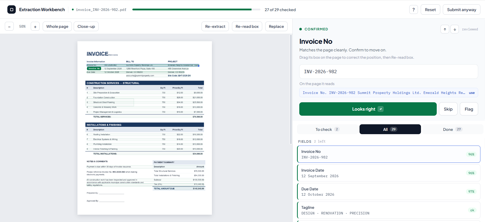

# Extraction Workbench
### One endpoint. Any document schema.

*How `ExtractionWorkbenchAPI` turns invoices, purchase orders, contracts, tenders, and forms into structured, schema-validated data — without a new code path for every document type.*

| | |
|---|---|
| **Component** | `ai_module.views.ExtractionWorkbenchAPI` |
| **Stack** | Django · Django REST Framework · Ollama · MarkItDown |

---

## Contents

1. [Executive Summary](#1-executive-summary)
2. [Business Challenge](#2-business-challenge)
3. [Solution Overview](#3-solution-overview)
4. [System Architecture](#4-system-architecture)
5. [API Design](#5-api-design)
6. [Detailed Processing Flow](#6-detailed-processing-flow)
7. [Key Features](#7-key-features)
8. [Technical Deep Dive](#8-technical-deep-dive)
9. [Security & Compliance](#9-security--compliance)
10. [Performance Optimization](#10-performance-optimization)
11. [Business Outcomes](#11-business-outcomes)
12. [Before vs. After Comparison](#12-before-vs-after-comparison)
13. [Lessons Learned](#13-lessons-learned)
14. [Future Enhancements](#14-future-enhancements)
15. [Conclusion](#15-conclusion)

---

## 1. Executive Summary

`ExtractionWorkbenchAPI` is the single API that powers the Extraction Workbench: an upload point where any business document — a purchase order, vendor invoice, tender, contract, or intake form — is converted into clean, structured data that matches an existing application schema, ready for review and commit.

Its core idea is unusual enough to be the whole business case: the view does not know what a "purchase order" or "invoice" looks like. It is told, at request time, which serializer defines the target shape (`?serializer=PurchaseOrderSerializer`), reads that serializer's fields by reflection, and asks a large language model to fill exactly those fields from the document text. Adding a new document type is a serializer change, not a new endpoint, a new prompt file, or a new parsing routine.

| Metric | Value |
|---|---|
| Extraction endpoints required per document type | **1** (shared across all types) |
| New code required to onboard a new document type | **0** lines of extraction logic |
| LLM calls per document | **1** — single-pass, deterministic (temperature 0) |

**The business problem it solves:** operations teams spend hours re-keying vendor and procurement documents into ERPs and line-of-business systems, one field at a time, with the error rate that comes from manual transcription at volume.

**Key benefits:** minutes instead of hours per document; a structured JSON output that lines up 1:1 with the receiving system's own data model; a review step built for correction rather than re-entry; and an architecture that scales to new document types by configuration, not by engineering backlog.

**Target users:** back-office and shared-services teams (AP, procurement, contracts, tendering), the engineering team maintaining the extraction platform, and the executives who own the cost and cycle-time of document-heavy processes.

**Expected outcome:** a shorter document-to-system cycle time, fewer transcription errors reaching downstream systems, and an auditable trail from source document to structured record.


---

## 2. Business Challenge

Every organization that runs procurement, accounts payable, or contract intake through paper or PDF documents carries the same structural cost: a human has to read the document before the system can use it.

- **Manual data entry** — Line items, totals, dates, and vendor details are retyped into an ERP by hand, once per document.
- **High processing time** — A multi-page purchase order or tender can take 10–20 minutes to key in correctly, longer with poor scans.
- **Human error** — Transposed digits, missed line items, and mismatched vendor names are routine at volume, and expensive downstream.
- **Format sprawl** — PDFs, scanned images, Word and Excel attachments, and email bodies all carry the same data in different shapes.
- **Unstructured content** — Tables, free-text clauses, and inconsistent vendor templates resist naive text extraction or regex parsing.
- **Compliance & auditability** — Without a record of what was extracted, by what, and corrected by whom, disputes and audits fall back to the paper trail.
- **Scattered workflows** — Different teams use different tools (spreadsheets, email, one-off scripts) for what is structurally the same extraction problem.

> **Representative benchmarks.** Figures below are illustrative ranges drawn from typical AP/procurement modernization efforts, not audited results for a specific deployment — use them to size the opportunity, not as a guarantee.

| Impact area | Typical manual baseline |
|---|---|
| Time per document | 8–20 minutes of keying and cross-checking |
| Error rate | 2–8% of fields, higher on multi-line-item documents |
| Backlog during peak volume | Multi-day queues at month-end / tender close |
| Audit readiness | Trail limited to the original paper/PDF and whoever remembers the exceptions |

---

## 3. Solution Overview

The Extraction Workbench centralizes document intake behind one API. A document goes in; a structured object that already matches the target application schema comes out, ready for a human to confirm rather than construct from scratch.

**End-to-end narrative:** An operator opens the Workbench for a given document type — say, purchase orders. The page (served by the same view, via `GET`) already knows the shape of a purchase order, because it asked the application's own `PurchaseOrderSerializer` what fields it has. The operator drops in a scanned PO. The `POST` handler converts the file to text, builds a prompt around the exact fields the serializer expects, and asks the configured LLM to extract them. The model returns JSON; the API validates that it parses and hands it back to the Workbench UI, where the operator sees the source document alongside the extracted fields, corrects anything the model got wrong, and commits the record.

| Capability | Status | Notes |
|---|---|---|
| Centralized extraction service | ✅ Current | One view, one workflow function (`extraction_workflow`), reused across every document type registered as a serializer |
| Document upload & processing | ✅ Current | Multipart upload handled in memory — no temp file on disk |
| OCR / text conversion | ✅ Current | `MarkItDown` normalizes PDFs, Office files, and images into Markdown text, using the LLM client for image captioning where native text extraction isn't possible |
| AI-powered field extraction | ✅ Current | Schema-derived, strict-JSON prompt sent once to a deterministic (temperature 0) LLM call |
| Data validation framework | 🔜 Roadmap | Today: JSON-shape validation only. Next: re-run the target DRF serializer for business-rule validation before commit |
| Human-in-the-loop correction | ✅ Current | Workbench UI is built around review-and-correct, not blind auto-commit |
| Structured response generation | ✅ Current | Output keys match the serializer field-for-field, including nested line-item arrays |
| Workflow orchestration | 🔜 Roadmap | Today: synchronous request/response. Next: queued batch runs and a review-status pipeline (see [§10](#10-performance-optimization), [§14](#14-future-enhancements)) |

---

## 4. System Architecture

The current implementation is deliberately thin: a Django view, a schema-introspection helper, a document-to-text converter, and one LLM call. The diagram below shows what exists today and, in the surrounding-services band, what an enterprise rollout typically adds around it.

```text
┌─────────────────────────────────────────────────────────────────────┐
│ CLIENT LAYER                                                         │
│  Extraction Workbench UI  (extraction-workbench.html + JS)          │
│   • document upload widget      • field review / correction grid    │
└──────────────────────────────────┬──────────────────────────────────┘
     GET  /extraction-workbench/          POST /extraction-workbench/
     (render page + live schema)          ?serializer=<SchemaName> + file
                                    │
                                    ▼
┌─────────────────────────────────────────────────────────────────────┐
│ DJANGO REST FRAMEWORK — ExtractionWorkbenchAPI (ai_module app)   │
│   get()  → get_schema() → render extraction-workbench.html          │
│   post() → validate upload → extraction_workflow(file, ref_schema)  │
└───────────────┬───────────────────────────────┬─────────────────────┘
                 │                               │
                 ▼                               ▼
┌───────────────────────────────┐   ┌─────────────────────────────────┐
│ SCHEMA LAYER                  │   │ DOCUMENT CONVERSION LAYER        │
│ GetModelStructureAPIView      │   │ MarkItDown                       │
│ reflects on ANY DRF           │   │  • native parsing: PDF/DOCX/XLSX │
│ serializer (Purchase Order,   │   │  • image → text via LLM caption  │
│ Invoice, Contract, Tender …)  │   │  → normalized Markdown text      │
│ incl. nested line-item        │   └────────────────┬──────────────────┘
│ (many=True) serializers       │                    │
└───────────────┬────────────────┘                    ▼
                │                    ┌─────────────────────────────────┐
                └───────────────────▶│ PROMPT LAYER                     │
                                     │ _build_extraction_prompt()       │
                                     │ scalar fields + line-item groups │
                                     │  → one strict JSON-only prompt   │
                                     └────────────────┬──────────────────┘
                                                       ▼
                                     ┌─────────────────────────────────┐
                                     │ AI LAYER                         │
                                     │ AIMaster model registry (Postgres)│
                                     │  → ChatOllama (Ollama Cloud)      │
                                     │  temperature = 0, single call     │
                                     │  pluggable: OpenAI / Claude / self-│
                                     │  hosted, per §14                  │
                                     └────────────────┬──────────────────┘
                                                       ▼
                                     ┌─────────────────────────────────┐
                                     │ RESPONSE LAYER                   │
                                     │ _parse_extraction_response()     │
                                     │  strip fences → locate {...} →   │
                                     │  json.loads → dict, or a clear   │
                                     │  400 with the raw model output   │
                                     └────────────────┬──────────────────┘
                                                       ▼
                                     ┌─────────────────────────────────┐
                                     │ STRUCTURED JSON RESPONSE          │
                                     │  field-for-field match to the     │
                                     │  requested serializer → Workbench │
                                     │  review grid → human commit       │
                                     └─────────────────────────────────┘

 SURROUNDING PLATFORM (present) ─── PostgreSQL (AIMaster, AISession, business tables) · Django auth/session
 SURROUNDING PLATFORM (roadmap) ─── Object storage for source documents · Celery + Redis for async/batch runs
                                     · dedicated OCR engine for scan-heavy volumes · audit-log store
```

| Layer | Today | Enterprise extension point |
|---|---|---|
| Frontend | Server-rendered Workbench page + JS review grid | Angular/React SPA sharing the same schema & extraction contract |
| Backend | Django + DRF, single view | Service-layer split as volume/document-type count grows ([§8](#8-technical-deep-dive)) |
| AI layer | Ollama Cloud via a DB-configured model registry | OpenAI / Claude / self-hosted models behind the same registry |
| OCR layer | MarkItDown (native parsing + LLM image captioning) | Tesseract, Azure Document Intelligence, Google Vision, or AWS Textract for scan-heavy, handwritten, or high-volume inputs |
| Storage | PostgreSQL for registry & business data | Object storage (S3/Blob) for source documents, with retention policy |
| Validation | JSON-shape parsing only | Re-run the target DRF serializer for field-level and business-rule validation, plus confidence scoring |
| Monitoring | Standard Django error responses | Structured logging, per-extraction audit rows, model-latency/error dashboards |


---

## 5. API Design

**Purpose:** serve the Workbench page for a given document schema, and accept a document upload to extract that schema's fields from it.

| Method | Route | Purpose |
|---|---|---|
| `GET` | `/extraction-workbench/` | Render the Workbench UI, pre-loaded with the live schema for `?serializer=` |
| `POST` | `/extraction-workbench/?serializer=<SerializerName>` | Upload one document; return extracted fields matching that serializer |

### Example request

```http
POST /extraction-workbench/?serializer=PurchaseOrderSerializer HTTP/1.1
Host: api.example.com
Content-Type: multipart/form-data; boundary=----wb

------wb
Content-Disposition: form-data; name="file"; filename="po_4471_scan.pdf"
Content-Type: application/pdf

<binary PDF bytes>
------wb--
```

### Example response — success (`200 OK`)

```json
{
  "po_number": "PO-2026-04471",
  "vendor_name": "Meridian Steel Supplies Pvt. Ltd.",
  "po_date": "2026-03-14",
  "delivery_date": "2026-03-28",
  "currency": "USD",
  "buyer_name": "Aminul Islam",
  "total_amount": "18450.00",
  "line_items": [
    {
      "description": "TMT Bar 12mm Fe500",
      "quantity": "20",
      "unit_price": "612.50",
      "amount": "12250.00"
    },
    {
      "description": "TMT Bar 16mm Fe500",
      "quantity": "10",
      "unit_price": "620.00",
      "amount": "6200.00"
    }
  ]
}
```

### Processing & validation steps

1. Reject if `file` is missing from the multipart payload.
2. Reject if the `serializer` query parameter is absent — there is no default schema.
3. Resolve the named serializer by reflection; fail clearly if the name doesn't match a known class.
4. Convert the upload to text; fail with a descriptive message if the file can't be read or yields no text.
5. Parse the model's response as JSON, tolerating markdown code fences and surrounding prose; fail with the raw output (truncated) if no valid JSON object is found.

### Error handling

| Condition | Response |
|---|---|
| No file attached | `{"request_status": 0, "msg": "File missing"}` |
| No `serializer` param | `{"request_status": 0, "msg": "Serializer missing"}` |
| Unreadable / unsupported file | `{"request_status": 0, "msg": "Could not read the uploaded file: …"}` |
| No extractable text | `{"request_status": 0, "msg": "No readable text found in the uploaded file"}` |
| Model output isn't valid JSON | `{"request_status": 0, "msg": "AI did not return valid JSON: …"}` |
| Unknown serializer name | `{"request_status": 0, "msg": "<ImportError/AttributeError detail>"}` |

All failure paths return through DRF's `APIException`, so every error takes the same envelope shape — the Workbench UI has one place to handle failures, not one per failure mode.

### Authentication, authorization, rate limiting, versioning

| Concern | Current state | Recommended for production rollout |
|---|---|---|
| Authentication | `permission_classes = (IsAuthenticated,)` — authenticated route | Session/token auth consistent with the rest of the platform; ([§9](#9-security--compliance)) |
| Authorization | None enforced at the view | Scope which serializers/document types a role may extract, alongside existing module permissions |
| Rate limiting | None | DRF throttling per user/IP, sized to LLM provider quotas and cost budget |
| Versioning | Unversioned route | URL or header-based versioning once external/partner consumers depend on the response shape |

---

## 6. Detailed Processing Flow

A single upload moves through ten stages, from raw bytes to a structured object a human can confirm.

**Step 1 — Document Upload**
The Workbench posts the file as multipart form data with the target `serializer` name in the query string.
*Data in: raw file bytes + serializer name.*

**Step 2 — File Validation**
The view checks that a file was actually attached and that a target schema was named before doing any work.
*Data out: proceed, or a 400 error envelope.*

**Step 3 — OCR / Conversion Processing**
The file is read fully into memory and handed to `MarkItDown` with its filename and content type, so it can pick the right converter (PDF, DOCX, XLSX, image, …).
*Data: bytes → raw Markdown text.*

**Step 4 — Text Preprocessing**
The Markdown output is trimmed; empty results are rejected early rather than sent to the model.
*Data out: `document_markdown` (string).*

**Step 5 — LLM Prompt Creation**
The target serializer is split into scalar fields and nested line-item groups; each key gets a human-readable label derived from its field name.
*Data: `ref_schema` + `document_markdown` → one prompt string.*

**Step 6 — Field Extraction**
The prompt is sent once to the configured LLM (temperature 0) with an instruction to return raw JSON only, using empty values rather than invented ones.
*Data out: model response text.*

**Step 7 — Schema (Shape) Validation**
The response is stripped of code fences, the largest JSON object is located, and it is parsed. Anything that isn't valid JSON is rejected with the offending text attached for debugging.
*Data out: parsed dict.*

**Step 8 — Confidence Analysis** *(🔜 Roadmap)*
Today the model runs deterministically but returns no per-field confidence. The recommended next step scores each field so the reviewer can triage by risk instead of reading every field.

**Step 9 — Human Review Queue**
The parsed object is returned to the Workbench UI for side-by-side review against the source document — the intended workflow, though today the API itself is stateless per call rather than tracking a formal queue.

**Step 10 — Final Structured Response**
Once confirmed, the corrected object is committed through the same serializer that defined the extraction target, closing the loop between "what we asked the model for" and "what we actually store."

---

## 7. Key Features

| Feature | Status | Description |
|---|---|---|
| Multi-document support | ✅ Current | Any document type modeled as a DRF serializer is a supported extraction target — no per-type code |
| Format-agnostic conversion | ✅ Current | PDF, Office formats, and images normalize to one text representation before extraction |
| AI-powered extraction | ✅ Current | Deterministic, schema-constrained prompting keeps output shape predictable |
| Nested line-item extraction | ✅ Current | Tabular sections (PO lines, invoice items) extract as arrays of objects, not flattened text |
| Confidence scoring | 🔜 Roadmap | Per-field confidence to prioritize reviewer attention |
| Reviewer workflow | ✅ Current | Workbench UI pairs source document and extracted fields for side-by-side correction |
| Editable extraction results | ✅ Current | Output is plain JSON matching an editable form, not a locked record |
| Validation engine | 🔜 Roadmap | Re-running the target serializer's own validators against extracted data before commit |
| Audit history | 🔜 Roadmap | Per-extraction record of source file, model version, and reviewer corrections |
| Retry mechanisms | 🔜 Roadmap | Automatic re-prompt on malformed JSON before surfacing an error to the user |
| Batch processing | 🔜 Roadmap | Multi-file upload processed as a set, with per-file status |
| Async processing | 🔜 Roadmap | Queue-backed extraction for large files or batch runs ([§10](#10-performance-optimization)) |

---

## 8. Technical Deep Dive

### View design

The view is intentionally thin — a `get()` that renders the Workbench template with a live schema, and a `post()` that validates input and delegates to a single workflow function. All exception handling funnels through one `try/except` that normalizes any error into the same `{"request_status": 0, "msg": …}` envelope.

```python
class ExtractionWorkbenchAPI(APIView):

    def get(self, request):
        schema = introspect(request.GET["serializer"])   # field-by-field reflection
        return render("extraction-workbench.html", schema=schema, ...)

    def post(self, request):
        try:
            file = require(request.FILES.get("file"), "File missing")
            serializer_name = require(request.query_params.get("serializer"), "Serializer missing")
            schema = introspect(serializer_name)
            return Response(extraction_workflow(file, schema))
        except Exception as e:
            raise APIException({"request_status": 0, "msg": str(e)})
```

### Serializer usage & the schema layer

The schema for any document type is not hand-written — it is derived by walking the target serializer's declared fields, recursing into nested serializers, and flagging `many=True` child serializers as repeating groups. That single reflection routine is what lets a purchase order, an invoice, and a tender share one extraction engine: each is "just" a serializer with different fields.

```python
def introspect(serializer_class, parent=None):
    schema = {}
    for name, field in serializer_class().fields.items():
        if name in SYSTEM_FIELDS or field.type in ("SerializerMethodField", "FileField"):
            continue
        entry = {"type": field.type, "required": field.required}
        if is_nested_serializer(field):
            entry["nested"] = introspect(field.serializer_class, parent=serializer_class)
        elif is_list_of_serializers(field):
            entry["many"] = True
            entry["nested"] = introspect(field.child.serializer_class, parent=serializer_class)
        schema[name] = entry
    return schema
```

### Prompt management

The prompt builder separates scalar fields (header-level data) from repeating groups (line items), generates a human-readable label for each key from its snake_case name, and closes with an explicit contract: JSON only, no invented values, empty string for anything not found.

```text
You are a strict data extraction engine. Read the document text below and output
ONLY one JSON object with exactly these keys: {all_keys}.
Field meanings: {field_hints}.
Rules:
- Use "" for any scalar field you cannot find in the text.
- Do not invent values.
- "line_items" must be an array with one object per line-item row found in the
  document (empty array if none). Each object must have exactly these keys:
  description, quantity, unit_price, amount.
- Output raw JSON only - no markdown, no code fences, no explanation.

Document text:
"""
{document_markdown}
"""
```

### Extraction engine & exception handling

The engine is a single function — convert, prompt, invoke, parse — with a distinct, user-legible `APIException` raised at every failure boundary (bad file, empty text, model error, bad JSON). That granularity is what makes the error table in [§5](#5-api-design) possible: each row maps to exactly one `raise` site.

### Service layer & repository pattern — current vs. recommended

Today, extraction logic lives as module-level functions in `ai_module/utils.py` rather than a formal service/repository split. That's a reasonable shape at the current scope (one workflow, one model provider). As document-type count and provider count grow, the natural refactor is to extract three seams: a **SchemaRepository** (wraps serializer introspection and caches per-serializer schemas), an **ExtractionService** (owns the convert → prompt → invoke → parse pipeline), and a **ModelProvider** interface (so Ollama, OpenAI, and Claude are interchangeable behind one call signature).

```python
class SchemaRepository:
    def get(self, serializer_name: str) -> Schema: ...        # cached

class ModelProvider(Protocol):
    def extract(self, prompt: str) -> str: ...

class ExtractionService:
    def __init__(self, schemas: SchemaRepository, model: ModelProvider, converter):
        ...
    def run(self, upload, serializer_name) -> dict:
        schema = self.schemas.get(serializer_name)
        text = self.converter.to_text(upload)
        prompt = build_prompt(text, schema)
        return parse_json(self.model.extract(prompt))
```

### Background jobs, queue processing, caching

None of these exist yet — every request runs synchronously inside the Django request/response cycle, including the OCR conversion and the LLM call. That's acceptable for interactive, single-document review, but it caps throughput and ties request latency directly to model latency. [§10](#10-performance-optimization) covers the Celery/Redis path and what to cache (schema introspection results, and prompt templates per serializer) versus what must never be cached (the extraction result itself, which is document-specific).

---

## 9. Security & Compliance

Document extraction touches two sensitive things at once: the content of business documents (often containing commercial terms, personal data, or pricing) and a third-party model call. Both need explicit controls before this becomes an internet-facing production path.

| Area | Current state | Recommendation |
|---|---|---|
| Authentication | Auth (`IsAuthenticated`) | Require the platform's existing session/token auth before go-live — see [§5](#5-api-design) |
| RBAC | Not enforced at this view | Gate by module permission, consistent with the rest of the permission model |
| Secure file handling | Upload is read fully into memory, never written to disk | Add a max-size limit and content-type allowlist before the conversion step |
| Encryption in transit | Depends on deployment TLS termination | Enforce HTTPS end-to-end, including to the LLM provider |
| Encryption at rest | N/A today (no document persisted by this view) | If source documents are persisted for audit, encrypt the object store and the audit table |
| Audit trail | None captured per extraction | Log who uploaded what, which model/version ran, and what the reviewer changed ([§7](#7-key-features), [§14](#14-future-enhancements)) |
| Third-party data exposure | Document text leaves the platform to the LLM provider | Confirm the model provider's data-retention terms; prefer a self-hosted or zero-retention endpoint for regulated document types |
| GDPR / data minimization | Not addressed at this layer | Redact or flag personal data fields before they reach the model where the use case allows it; document a lawful basis for processing |
| Logging strategy | Errors surface via DRF's standard exception handling | Structured, correlation-ID-tagged logs per request; never log full document text at info level |


---

## 10. Performance Optimization

Today's synchronous path is fine for one operator reviewing one document at a time. It will not hold up under batch tender intake or month-end AP spikes without the changes below.

| Lever | What it addresses |
|---|---|
| Async processing (Celery) | Decouples upload acknowledgment from OCR + LLM latency; the operator gets a job ID immediately, results arrive via polling or a websocket push |
| Redis (broker + result backend) | Backs the Celery queue and can cache per-serializer schema introspection, which is static per deployment |
| Parallel OCR/conversion | Fan out multi-file batch uploads across workers instead of converting sequentially |
| Prompt optimization | Trim document text to the relevant pages/sections before prompting to cut token cost and latency on long contracts |
| Batch extraction | Group same-schema documents into fewer, larger model calls where the provider supports it, instead of one call per file |
| Database indexing | Index the model registry (`AIMaster`) and any new audit/extraction-history tables on the fields actually queried (tag, session, document type, date) |

### Scalability recommendations

- Move the `post()` handler to enqueue a Celery task and return `202 Accepted` with a job reference once volume exceeds interactive, one-at-a-time review.
- Cache schema introspection per serializer name (it only changes on deploy) — this removes a full field-reflection pass from every single request.
- Set a hard per-file size ceiling and page-count ceiling before OCR, to bound worst-case latency and cost per job.
- Track model latency and token usage per call from day one, so scaling decisions are based on measured cost, not estimates.

---

## 11. Business Outcomes

The value case rests on three levers: less time per document, fewer errors reaching downstream systems, and a defensible audit trail. Figures are representative KPI targets for a rollout of this shape, to be replaced with measured numbers after pilot.

| KPI | Manual baseline | Target with Extraction Workbench |
|---|---|---|
| Time per document | 8–20 min | **1–3 min** (review + correct) |
| Field-level error rate | 2–8% | **&lt;1%** after human review |
| Time-to-approval (PO/tender) | Same-day to multi-day | **Same-shift** |
| Audit trail completeness | Paper/PDF only | Source file + extracted fields + reviewer diff *(🔜 roadmap)* |

**Reduced operational risk:** a document type that used to require a bespoke script or a manual SOP now requires only a serializer definition, which the engineering team already maintains for the application itself — extraction coverage grows with the data model, not against a separate backlog.

---

## 12. Before vs. After Comparison

| Dimension | Manual Process | Extraction Workbench |
|---|---|---|
| Time | 8–20 minutes/document, worse on multi-page POs | **1–3 minutes** of review per document |
| Accuracy | Transcription error scales with volume and fatigue | Deterministic model pass + human correction catches outliers |
| Effort | Full manual keying, one field at a time | Review and correct pre-filled fields |
| Compliance | Trail limited to the source document | Source + structured output, extending to full audit log ([§14](#14-future-enhancements)) |
| Scalability | Linear in headcount | Linear in compute; new document types add a serializer, not a process |

---

## 13. Lessons Learned

**Implementation challenges**
Keeping the extraction contract generic across very different document shapes — a two-line intake form versus a forty-line tender — required committing early to the scalar-vs-line-items split in the prompt builder, rather than special-casing document types in code.

**AI extraction limitations**
A single-pass, temperature-0 prompt is predictable but not infallible: it can misread a poorly scanned total, or split a merged table cell incorrectly. It has no visibility into cross-field business rules (e.g., that line items should sum to the total) unless those checks are added explicitly downstream.

**OCR / conversion quality issues**
Conversion quality is only as good as the source scan. Rotated pages, low-contrast faxes, and handwritten annotations degrade the Markdown text the model sees, which degrades extraction regardless of how good the prompt is — this is the strongest argument for a dedicated OCR engine option on harder document sets ([§4](#4-system-architecture)).

**Why validation matters**
JSON-shape validation (does it parse?) is necessary but not sufficient. Business-rule validation (does the total match the line items? is the vendor known?) is what actually protects downstream systems, and it's naturally implemented by reusing the same serializer that defined the schema in the first place.

**Human review as a design principle, not a fallback**
Treating the model's output as a draft for a human to confirm — rather than a final write — is what makes single-pass extraction acceptable at all. It turns model imperfection into a review-time cost instead of a downstream data-quality incident.

---

## 14. Future Enhancements

| Enhancement | Business Value |
|---|---|
| RAG over historical extractions | Ground extraction in prior documents from the same vendor (known formats, known part numbers) |
| Vector database for document similarity | Auto-route a new document to the vendor/template it most resembles, improving prompt targeting |
| Active learning from reviewer corrections | Feed corrected fields back to improve prompts or fine-tune extraction over time |
| Auto-correction rules | Deterministic fixes for known patterns (e.g., OCR digit confusion) before a field reaches review |
| Agentic multi-step workflows | Chain extraction → validation → ERP posting as one supervised agent run, with human checkpoints |
| Multi-language extraction | Serve markets where source documents aren't in the platform's primary language |
| SAP / ERP integration | Push confirmed records directly into procurement/finance systems, closing the loop end-to-end |
| Workflow automation | Route by document type/value to the right approver automatically after extraction |

---

## 15. Conclusion

The core insight behind `ExtractionWorkbenchAPI` is architectural restraint: rather than building a bespoke extraction path per document type, it makes the application's own data model — its DRF serializers — the single source of truth for what "correct" extraction looks like. That choice is what turns a document-intake bottleneck into a configuration problem.

**Business impact:** minutes instead of tens of minutes per document, an error rate bounded by human review rather than fatigue, and a document pipeline that grows with the data model instead of a separate backlog.

**Technical innovation:** schema-driven prompting from live serializer reflection, a deterministic single-pass extraction call, and a response parser tolerant enough to survive real-world model output.

**What's next:** the roadmap items flagged throughout this document — authentication, confidence scoring, an audit trail, and async batch processing — are the difference between a strong internal tool and a production-grade enterprise capability. None of them require re-architecting the core idea; they build on it.
