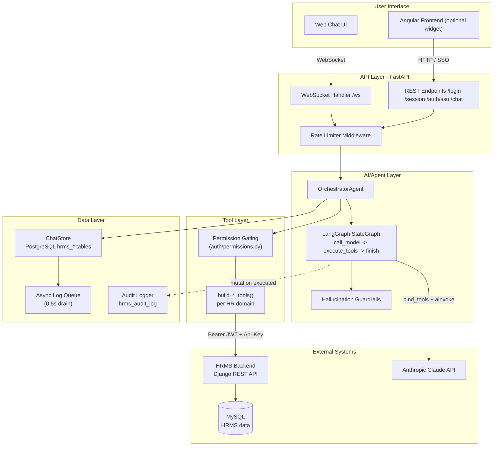
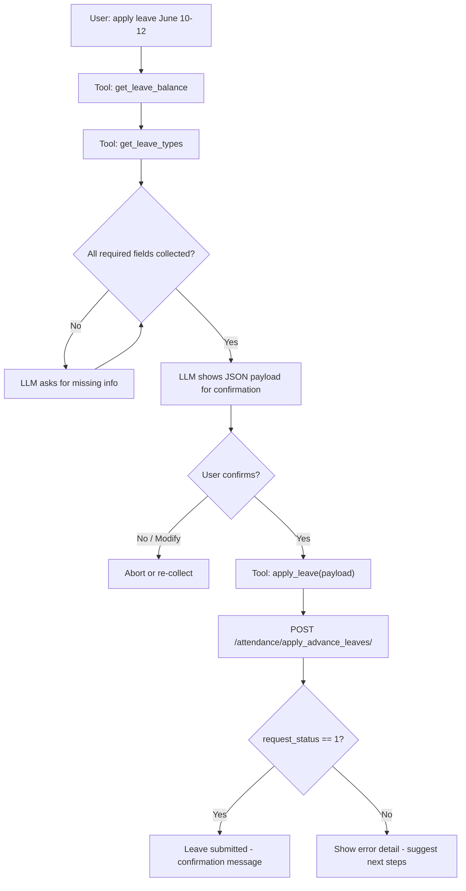

# HRMS Agent: A Permission-Aware Conversational AI Layer for HRMS Self-Service

---

## Executive Summary

Employees at organizations running the HRMS (Human Resource Management System) platform previously had to navigate multi-step UI forms to complete routine tasks such as checking leave balances, applying for leave, or reviewing team attendance. **HRMS Agent** replaces that friction with a natural-language chat interface layered directly on top of the existing HRMS backend, allowing employees to accomplish the same tasks by simply describing what they want.

The solution is built as a standalone FastAPI service that orchestrates a LangChain/LangGraph tool-calling agent backed by Anthropic's Claude models. Rather than replacing HRMS, HRMS Agent acts as a conversational front door: it authenticates against the existing HRMS login system, inherits the user's exact permission set from HRMS, and executes actions through a permission-gated tool layer that calls the HRMS REST API on the user's behalf. All HR data continues to live exclusively in HRMS's MySQL database — HRMS Agent stores only conversational and operational metadata (sessions, capabilities, chat history, audit logs) in its own PostgreSQL schema.

Technically, the system combines FastAPI (async web/WebSocket framework), LangGraph (explicit state-machine modeling of the tool-calling loop), `httpx` (async HTTP client), and Anthropic Claude (Haiku by default, Sonnet for higher-accuracy scenarios) with Pydantic v2 for validation. Security-sensitive design choices — fail-closed authorization, server-generated session tokens, mutation confirmation gates, async audit logging, and tenant isolation — reflect the reality that this agent operates against sensitive HR data on behalf of individually-permissioned users.

Strategically, the architecture was deliberately built for extensibility: new HR domains (payroll, appraisal, attendance) can be added as independent, permission-gated tool groups without altering the core orchestration logic, and the same codebase can run against different database backends (MySQL in development, PostgreSQL tenant schemas in production) via a single environment flag — positioning HRMS Agent as a reusable conversational layer rather than a one-off integration.

---

## Business Challenge

- **Complex UI overhead for routine tasks.** Employees needed to navigate multi-step forms in the HRMS UI to perform simple, high-frequency actions like checking a leave balance or submitting a leave request.
- **No conversational access path.** HRMS exposed functionality only through its REST API and web UI — there was no natural-language interface for employees or managers.
- **Risk of duplicating a system of record.** Any new interface layer had to avoid becoming a second source of truth for HR data, which would create data-integrity and compliance risk.
- **Multi-tenant, individually-permissioned user base.** HRMS permissions are granted per user rather than by broad role, meaning any new access layer had to respect exact, per-user permission grants rather than approximate them.
- **Need to integrate without disrupting the existing Angular frontend.** Any chat capability had to coexist with the existing Angular HRMS web application and its established login flow.

---

## Objectives

- Provide a natural language interface over the existing HRMS REST API, without bypassing or duplicating it.
- Build a modular, extensible tool architecture so new HR domains (payroll, appraisal, attendance) can be plugged in as independent tool groups.
- Integrate with the existing Angular HRMS frontend as an embeddable chat widget, including single sign-on (SSO), without requiring a second login.
- Ensure every user only has access to the tools their actual HRMS permissions allow — with no fallback or role approximation.
- Never store HR data independently of HRMS's MySQL database; keep the agent's own storage limited to conversational and operational metadata.
- Support horizontal scalability through a stateless request model.
- Keep LLM inference costs manageable through prompt caching.
- Guarantee an auditable trail for every state-changing (mutating) action taken through the agent.

---

## Solution Overview

**What was built:** HRMS Agent is a FastAPI-based conversational AI service ("hrms_agent") that sits between end users and the existing HRMS Django REST API. It exposes both a WebSocket endpoint (`/ws`) and REST endpoints (`/api/v1/login`, `/logout`, `/session`, `/auth/sso`, `/chat`) for chat interactions, authentication, and session management.

**How users interact with it:** Employees converse with the agent through a web chat UI (browser-based, served from `index.html`) or through the existing Angular HRMS frontend, which can embed the chat experience as a widget using an SSO flow (iframe + `postMessage`) that reuses the user's existing HRMS login — no second authentication step required.

**Core architecture approach:** The system follows a three-tier conversational AI architecture:
1. **Client Layer** — the web chat UI and the optional Angular frontend.
2. **HRMS Agent Server** — the FastAPI application containing the WebSocket/REST handlers, the `OrchestratorAgent`, the permission-gating layer, the tool layer, and the `ChatStore` persistence layer.
3. **External Services** — the HRMS Django REST backend and the Anthropic Claude API.

**Major capabilities:**
- Natural-language leave balance checks, leave applications, and team attendance queries.
- A LangGraph-driven tool-calling loop (`call_model → execute_tools → finish`/`force_final`, bounded to 4 rounds) with built-in hallucination detection and self-correction retry.
- Per-user, permission-based tool gating derived directly from the user's live HRMS permission tree.
- Mandatory confirmation of the exact payload before any state-changing action executes.
- Asynchronous, non-blocking audit logging of every mutation.
- Session security via server-generated tokens in `HttpOnly` cookies with an 8-hour TTL.
- Tenant isolation enforced at the environment-configuration level, not from user-supplied input.

---

## Key Features

| Feature | Description | Benefit |
|----------|-------------|----------|
| Natural language HR assistant | Employees ask for leave balances, apply for leave, and check team attendance in plain language | Removes the need to learn or navigate complex HRMS UI forms |
| LangGraph tool-calling agent loop | Explicit `StateGraph` with nodes `call_model → execute_tools → finish`/`force_final`, capped at 4 rounds | Makes the reasoning/tool-execution loop predictable, testable, and boundable |
| Hallucination self-correction | Detects JSON tool calls emitted as plain text and retries without prompt cache | Reduces incorrect or unexecuted actions caused by model output errors |
| Permission-based tool gating | Tools are assembled per user at login using exact alias matching against the HRMS permission tree | Ensures the LLM can never see or call a tool the user isn't authorized to use |
| Fail-closed authorization | Login is blocked if the HRMS permission-list endpoint fails, with no role fallback | Prevents privilege escalation through guessed or default roles |
| Mutation confirmation gate | Every state-changing tool (apply/cancel leave, approvals, regularization) shows the payload and waits for explicit user confirmation | Protects HR data integrity from accidental or misinterpreted actions |
| Async mutation audit trail | Every mutating tool call is logged to `hrms_audit_log` without blocking the chat response | Provides compliance-grade traceability without latency cost |
| Rate limiting | Sliding-window limiter, keyed by session for chat and by client IP for login/SSO | Mitigates abuse and brute-force login attempts |
| Secure session handling | Server-generated `secrets.token_urlsafe(32)` token stored only in an `HttpOnly; SameSite=lax` cookie, 8-hour TTL | Eliminates token leakage via URLs, logs, or client-side scripts |
| Tenant isolation | `DB_TENANT` read from server-side `.env`, never from request input, stamped on every log row | Prevents cross-tenant data exposure (IDOR) |
| SSO / Angular widget integration | `POST /api/v1/auth/sso` validates an HRMS-issued JWT and creates a session via iframe + `postMessage` | Lets the chat widget embed in the existing Angular app with no re-login |
| Prompt caching | Anthropic prompt caching applied to the static system prompt | Reduces input token cost by roughly 90% on cached turns |
| Stateless agent | `OrchestratorAgent` rebuilt per request from PostgreSQL session state | Enables horizontal scaling with no in-memory state to synchronize |

---

## Architecture Overview

- **User Interface** — A browser-based web chat UI (WebSocket-driven) and an optional Angular frontend integration that embeds the chat as a widget via SSO.
- **API Layer** — FastAPI routes split by concern: `admin.py` (health/config/caching), `auth.py` (login/logout/session/SSO), `chat.py` (REST chat), and `ws.py` (WebSocket chat), all sitting behind rate-limiting middleware.
- **AI/Agent Layer** — The `OrchestratorAgent`, implemented as a LangGraph `StateGraph` (`agents/graph.py`), coordinating model calls, tool execution, hallucination guardrails (`hallucination.py`), deterministic date resolution (`date_resolver.py`), and LLM instantiation (`llm_factory.py`), driven by a static, cached system prompt.
- **Tool Layer** — `build_*_tools(client, caps)` functions assemble a permission-filtered tool set per session, backed by `HRMSClient`, a package of domain-specific mixins (leave, attendance, team, HR) plus a centralized enum module for consistent HRMS values.
- **Data Layer** — `ChatStore` persists sessions, capabilities, and chat history synchronously to PostgreSQL `hrms_*` tables (public schema); an async queue (`log_queue.py`) batches and drains LLM-usage and audit logs every 0.5 seconds so they never add latency to a chat turn.
- **External Systems** — The HRMS Django REST API (source of truth for all HR data, backed by MySQL) and the Anthropic Claude API (LLM inference).

---

## Architecture Diagram

---

## User Journey

1. The user authenticates — either directly via HRMS credentials (`/user/login/`) or via SSO, where the Angular frontend passes an existing HRMS JWT to `POST /api/v1/auth/sso`.
2. HRMS Agent fetches the user's full permission tree from HRMS (`/users/auth_user_all_permission_list/`); if this call fails, login is blocked entirely (fail-closed).
3. A server-generated session token (`secrets.token_urlsafe(32)`) is issued in an `HttpOnly; SameSite=lax` cookie, and the user's capabilities are stored as JSON in PostgreSQL.
4. The user sends a message (e.g., "What is my leave balance?") over WebSocket or REST.
5. The `OrchestratorAgent` loads session state (JWT, capabilities, recent history) from `ChatStore` and assembles the permission-filtered tool set for this user.
6. The agent invokes Claude with the cached system prompt, conversation history, and the new message.
7. If Claude responds with a tool call, the corresponding tool executes against the HRMS REST API using the user's Bearer JWT and the service's `Api-Key` header (up to 4 rounds of tool calling).
8. For any state-changing action (e.g., applying for leave), the agent presents the exact payload and waits for explicit user confirmation before executing it.
9. Tool results are fed back to Claude, which produces a final natural-language response.
10. The conversation turn is saved synchronously to `ChatStore`; LLM usage and (for mutations) audit records are queued for asynchronous, non-blocking persistence.
11. The response is returned to the user over the same WebSocket or REST channel.

---

## Technical Deep Dive

### Frontend
A browser-based web chat UI (`index.html`) communicates with the agent primarily over WebSocket. Optionally, the existing Angular HRMS frontend embeds the same chat experience as a widget, integrated via an SSO flow using an iframe and `postMessage`, so the user's existing Angular session carries over without a second login. 

### Backend
The service is built on **FastAPI** for its native async and WebSocket support, served by `uvicorn`. Routes are deliberately split by concern (`admin.py`, `auth.py`, `chat.py`, `ws.py`) rather than kept in a single file, and all request/response data is validated with **Pydantic v2**. All outbound calls to HRMS use `httpx.AsyncClient`, keeping the entire request path non-blocking.

### AI Orchestration

The core reasoning loop is implemented with **LangChain** and **LangGraph**. Rather than a hand-written loop, the tool-calling cycle is modeled as an explicit `StateGraph` (`agents/graph.py`) with nodes `call_model → execute_tools → finish`/`force_final`, bounded to 4 rounds. A dedicated hallucination-detection module (`hallucination.py`) checks for tool calls that the model emitted as plain text instead of a structured call, and triggers a bounded retry (without prompt cache) when this is detected. The static system prompt is cached via Anthropic's prompt caching API, cutting input token cost by roughly 90% on cached turns. The agent itself is stateless — it is rebuilt from PostgreSQL session state on every request, which is what allows the service to scale horizontally.

### Integrations
- **HRMS Backend** — a Django REST API accessed over HTTP/1.1 with JWT Bearer authentication (obtained via `/user/login/`) and a 30-second per-request timeout. Requests also carry an `Api-Key: <HRMS_API_KEY>` header that bypasses HRMS's payload-encryption middleware for trusted internal traffic.
- **Anthropic Claude** — accessed via `langchain-anthropic`'s `ChatAnthropic`, defaulting to `claude-haiku-4-5-20251001` (configurable via `ANTHROPIC_MODEL`), with Sonnet available for higher-accuracy needs. Temperature is fixed at 0 for deterministic tool calls, with a 1500-token response cap and a single retry.

### Data Persistence
HRMS Agent deliberately separates two categories of data:
1. **`hrms_*` log tables** (sessions, capabilities, chat messages, LLM usage, audit records) — always written via `hrms_db.py`, routed to either PostgreSQL or MySQL by the `DB_BACKEND` flag, and always tenant-stamped.
2. **HRMS data** — accessed primarily through the HRMS REST API; a separate raw-SQL escape hatch (`tools/db_client.py`) exists for complex queries not covered by the API, hitting MySQL in development or a PostgreSQL tenant schema in production.

Chat messages and session state are written synchronously for consistency; observational data (LLM usage, audit logs) is queued and drained every 0.5 seconds via batched `execute_many` inserts, so logging never adds latency to a chat response.

### Security
Security is treated as foundational rather than additive, given that the agent acts on sensitive HR data on a per-user, permission-scoped basis. Authentication is fully delegated to HRMS — HRMS Agent never stores passwords. Authorization is fail-closed: if the HRMS permission endpoint fails or returns no data, login is blocked outright rather than falling back to a guessed role. Every tool exposed to the LLM is filtered per user from a capability set loaded fresh from PostgreSQL on each turn — unauthorized tools simply do not exist in that session's context.

---

## Data Flow

### 1. Request Processing
An incoming chat message (WebSocket or REST) passes through the rate-limiting middleware, then the `OrchestratorAgent` loads the session's JWT, permission capabilities, and recent conversation history from `ChatStore`.

### 2. Tool Execution
Claude is invoked with the cached system prompt, history, and the new message. If it returns tool calls, each is executed via the permission-filtered tool set against the HRMS REST API (Bearer JWT + `Api-Key` header), for up to 4 rounds. State-changing tools require an explicit user confirmation before execution.

### 3. Response Generation
Tool results are returned to Claude as `ToolMessage`s, and the model produces a final natural-language response, or issues further tool calls within the round limit.

### 4. Logging / Auditing
The completed turn (user + assistant messages) is saved synchronously to PostgreSQL. LLM usage metrics are pushed to the async log queue. If a mutation tool was executed, an audit record is queued to `hrms_audit_log` — this write is asynchronous and a logging failure never blocks the chat response.

---

## Security & Governance

- **Authentication** — Fully delegated to HRMS's `/user/login/` endpoint; HRMS Agent never stores user passwords.
- **Authorization** — The user's full permission tree is fetched from HRMS (`/users/auth_user_all_permission_list/`) and parsed via exact alias matching against `core_frontend_menu_master`.
- **Permission controls** — `build_tool_list(client, caps)` binds only the tools the user is permitted to use; unpermitted tools are never bound to the LLM.
- **Session management** — Session tokens are server-generated with `secrets.token_urlsafe(32)`, stored only in an `HttpOnly; SameSite=lax; Secure (on HTTPS)` cookie, and expire after 8 hours via an `expires_at` column checked on every `get_session_state()` call.
- **Tenant isolation** — `DB_TENANT` is read from the server's `.env` at deploy time — never from a URL parameter or request body — and stamped as a `tenant` column on every log row, preventing IDOR-style tenant switching.
- **Audit logging** — Every tool in `MUTATION_TOOLS` (apply/cancel leave, regularization, leave and HR-level approvals, attendance reprocess/close) is logged asynchronously to `hrms_audit_log`; a logging failure only produces a warning and never blocks the chat turn.
- **Rate limiting** — An in-memory sliding-window limiter protects REST chat and WebSocket chat (keyed by session) and login/SSO endpoints (keyed by client IP, for brute-force protection).

| Security Aspect | Implementation |
|---|---|
| Authentication | Delegated entirely to HRMS `/user/login/` |
| Session token | `secrets.token_urlsafe(32)`, server-generated, never client-supplied |
| Session cookie | `HttpOnly; SameSite=lax; Secure (on HTTPS)` |
| Session expiry | 8-hour TTL via `expires_at` column |
| Permission fetch | Called at every login; fail-closed if it fails or returns `None` |
| Per-user tool set | Only permitted tools bound to the LLM per session |
| JWT storage | Server-side PostgreSQL only, never sent to the browser |
| SSO validation | JWT validated against HRMS `get_user_permissions()`; `user_id` cross-checked against JWT claim |
| Encryption bypass | Internal `Api-Key` header bypasses HRMS payload encryption for trusted service-to-service calls |
| LLM guardrail | System prompt explicitly forbids exposing JWT tokens |
| CORS | Permissive (`*`) — This is suitable for internal/intranet deployment only |
| Tenant isolation | `DB_TENANT` sourced from `.env`, never from request input |
| Rate limiting | Sliding-window, session-keyed (chat) and IP-keyed (login/SSO) |
| Mutation audit trail | Async logging of all `MUTATION_TOOLS` calls to `hrms_audit_log` |
| SSO localStorage decryption | AES-256-CBC decryption of Angular's encrypted blobs performed server-side; shared secret never reaches the browser |

---

## Technology Stack

| Layer | Technology | Purpose |
|---|---|---|
| Web framework | FastAPI | Async request handling and native WebSocket support |
| ASGI server | uvicorn | Application server (`reload=True` in dev) |
| AI framework | LangChain + LangGraph | Agentic tool-calling loop implemented as a `StateGraph` |
| LLM provider | Anthropic Claude (`ChatAnthropic`) | Claude Haiku 4.5 by default; Sonnet for higher accuracy |
| HTTP client | httpx (async) | Non-blocking calls to the HRMS REST API |
| Log storage | PostgreSQL or MySQL via `hrms_db.py` | Chat sessions, messages, LLM usage, and audit data, tenant-stamped |
| HRMS data queries | PyMySQL (dev) / PostgreSQL (prod) | Raw-SQL escape hatch for queries not covered by the REST API |
| Data validation | Pydantic v2 | Request/response schema validation |
| Runtime | Python 3.12 (conda env `hrmsagent`) | Application runtime |
| Configuration | python-dotenv | `.env`-based environment configuration |

---

## Key Design Decisions

| Decision | Choice | Reasoning |
|---|---|---|
| LLM provider | Anthropic Claude | Reliable tool-calling, prompt caching support, consistent output quality |
| Tool-calling loop | LangGraph `StateGraph` | Explicit node graph makes the hallucination retry loop and per-round token accounting easy to test and reason about; superseded an earlier hand-written `while`-loop, which was A/B toggled and later removed once LangGraph was fully adopted |
| Authorization data | Static `auth/permission_map.py` file | Separates permission data from logic, so non-engineers can extend mappings without touching code |
| Fail-closed permissions | Login blocked on permission fetch failure, no role fallback | A multi-user HRMS with individually assigned permissions cannot be safely approximated by a guessed role |
| Session token | Server-generated `secrets.token_urlsafe(32)` in an `HttpOnly` cookie | Client-generated UUIDs were previously exposed in WebSocket URLs (server logs) and `localStorage` (XSS-readable) |
| Session expiry | 8-hour TTL via `expires_at` column | Prevents indefinitely-living sessions after a browser is closed without logging out |
| Session storage | PostgreSQL public schema via `hrms_db.py` | Dedicated log database, separate from HRMS data, with a pooled connection (2–10) reused across requests |
| SSO integration | `POST /api/v1/auth/sso` + iframe `postMessage` | Keeps the existing static login form unchanged; SSO is purely additive |
| HTTP client | Async `httpx` | Non-blocking, pairs naturally with FastAPI's async model |
| Direct DB access | Two separate connections — `hrms_db.py` for logs, `tools/db_client.py` for HRMS raw-SQL escape hatches | Clean separation of concerns between log storage and HRMS data access |
| Async write queue | `asyncio.Queue` + background drain task | Observational logging (usage, audit, eval) must not add latency to chat responses |
| Tenant column vs. separate tables | Single `tenant` VARCHAR(64) column on all log tables | Enables single-place superadmin reporting without table-per-tenant proliferation |
| `DB_BACKEND` switch | Env-driven `mysql` / `postgres` routing | Same codebase deployed with different `.env` configuration across dev and production |
| Stateless agent | Rebuilt from PostgreSQL session state per request | Enables horizontal scaling with no in-memory state leaks between requests |
| Mutation confirmation | Payload shown before every mutating action | Prevents accidental mutations; critical for HR data integrity |
| Closure-based tools | `build_*_tools(client, caps)` pattern | Each session gets its own JWT-bound, permission-filtered tool set, avoiding global mutable state |
| HRMSClient packaging | `tools/hrms_client/` split into domain mixins | Each HR domain (leave, attendance, team, HR) is independently editable |
| Enum centralization | Single `tools/hrms_enums.py` source of truth | Backend model choices defined once and imported rather than hardcoded per tool file |

---

## Scalability & Reliability

- **Stateless request handling** — Because the `OrchestratorAgent` is rebuilt from PostgreSQL session state on every request, the service can scale horizontally without session affinity.
- **Full async I/O** — FastAPI, `httpx.AsyncClient`, and LangChain's `ainvoke` are used throughout, avoiding blocking calls anywhere in the request path.
- **Non-blocking observability** — The async log queue (draining every 0.5 seconds with batched `execute_many` inserts) keeps LLM usage and audit logging off the latency-critical chat path.
- **Connection pooling** — PostgreSQL access is pooled (2–10 connections, configurable via `PG_POOL_MIN`/`PG_POOL_MAX`) and reused across requests.
- **Bounded agent loop** — The tool-calling loop is capped at 4 rounds, preventing runaway LLM/tool cycles.
- **Cost-efficient inference** — Prompt caching of the static system prompt reduces input token cost by roughly 90% on cached turns, keeping inference costs predictable as usage grows.
- **Maintainability by separation** — Domain-specific tool mixins, a centralized enum module, and a data-only permission-mapping file all keep the codebase modular as new HR domains are added.

---

## Challenges & Mitigations

| Challenge | Mitigation |
|---|---|
| LLM occasionally emits tool calls as plain text instead of structured calls | `hallucination.py` detects this pattern and triggers a bounded retry without prompt cache |
| Accidental or misinterpreted mutations to HR data (leave, approvals, regularization) | Every mutating tool requires the exact payload be shown and explicitly confirmed by the user before execution |
| HRMS permissions are individual, not role-based, making broad role assumptions unsafe | Fail-closed authorization: login is blocked outright if the permission-list fetch fails |
| Risk of cross-tenant data exposure (IDOR) in a shared log schema | `DB_TENANT` is sourced only from server-side `.env`, never from request input, and stamped on every log row |
| Session tokens previously leaked via WebSocket URLs (server logs) and `localStorage` (XSS) | Server-generated tokens now live only in an `HttpOnly; SameSite=lax` cookie |
| Observability (usage/audit logging) must not slow down chat responses | Logging is queued and drained asynchronously every 0.5 seconds, and failures never block the chat turn |
| Adding SSO without disrupting the existing static login UI | SSO implemented as a purely additive `POST /api/v1/auth/sso` endpoint plus an iframe/`postMessage` pattern |
| HRMS's own middleware encrypts payloads, which would block trusted internal calls | A dedicated `Api-Key` header lets HRMS Agent bypass encryption as a trusted internal caller |

---

## Innovation Highlights

- **Explicit state-machine agent loop.** Modeling the tool-calling cycle as a LangGraph `StateGraph` (rather than an implicit or hand-rolled loop) makes the hallucination self-correction path and per-round token accounting independently testable.
- **Individually-permissioned tool gating.** Tool availability is derived from each user's exact HRMS permission grants via alias matching, not from a coarse role — matching HRMS's own granular permission model rather than approximating it.
- **Dual-backend data routing.** A single `DB_BACKEND` environment flag lets the same codebase run against MySQL in development and a PostgreSQL tenant schema in production, without code branching.
- **Server-side SSO bridging.** Angular's AES-256-CBC-encrypted `localStorage` authentication blobs are decrypted server-side (`auth/hrms_crypto.py`), so the shared decryption secret never reaches the browser.
- **Confirmation-gated mutations by design.** Every state-changing action is architecturally required to pass through a "show payload, wait for yes" gate, rather than relying on prompt instructions alone.
- **Cost-aware LLM usage.** Prompt caching of the static system prompt is built in by default, cutting input token costs by roughly 90% on cached turns.

---

## Business Value

- **Reduced friction for routine HR self-service.** Employees can check leave balances, apply for leave, and review team attendance conversationally instead of navigating multi-step UI forms.
- **No duplication of the system of record.** All HR data continues to live exclusively in HRMS's MySQL database, avoiding the data-integrity and compliance risk of a parallel data store.
- **Extensible foundation for future HR domains.** The permission-gated, closure-based tool architecture allows payroll, appraisal, and attendance capabilities to be added as independent tool groups.
- **Preserves existing frontend investment.** SSO integration with the Angular frontend means the existing login experience is unchanged; the chat capability is purely additive.
- **Lower and more predictable inference cost.** Default prompt caching reduces input token cost by roughly 90% on cached turns.
- **Auditable, compliance-oriented operation.** Every mutating action is logged to a dedicated audit trail without adding latency to the user experience.

---

## Future Enhancements

- **Expand tool coverage to additional HR domains** (payroll, appraisal), consistent with the architecture's stated goal of modular, pluggable tool groups.
- **Harden CORS configuration for broader deployment.** The current permissive (`*`) CORS policy is "suitable for internal/intranet deployment only" — an explicit allow-list would be a prerequisite for wider exposure.
- **Formalize dead-code cleanup.** The `pg_client.py` identifies as superseded, unused code with no remaining importers; removing it would reduce maintenance surface.
- **Extend the multi-tenant model.** Given the existing `DB_TENANT` column and tenant-stamping scaffolding, the architecture appears well-positioned to onboard additional tenant deployments.

---

## Conclusion

HRMS Agent demonstrates how a conversational AI layer can be added on top of an existing, permission-sensitive enterprise system without duplicating its data or compromising its access controls. By combining a LangGraph-orchestrated tool-calling agent with strict, per-user permission gating, fail-closed authorization, mutation confirmation gates, and asynchronous audit logging, the architecture treats security and data integrity as first-class design constraints rather than afterthoughts. Its stateless request model, async I/O throughout, and environment-driven database routing give it a clear path to horizontal scale and multi-tenant deployment, while its closure-based tool pattern and domain-mixin structure keep it extensible as new HR domains are added. The result is a natural-language front door to HRMS that is both immediately useful for routine employee self-service and architecturally prepared for broader scope.
