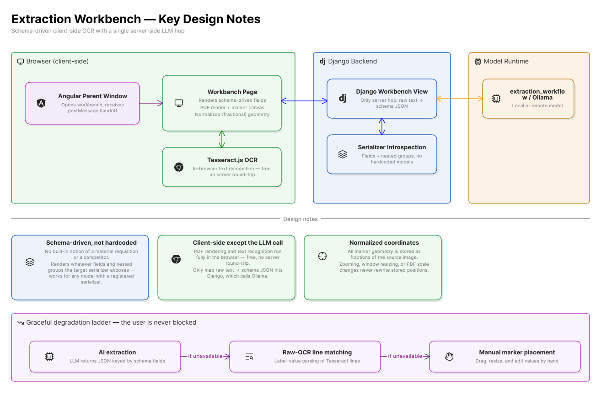
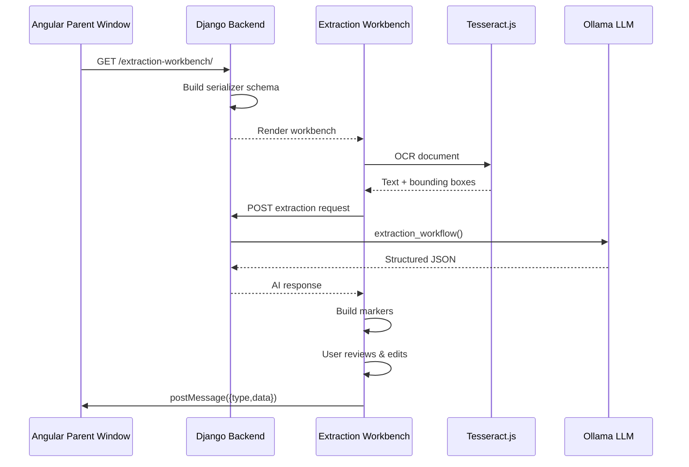
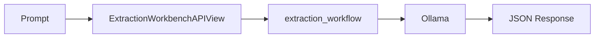
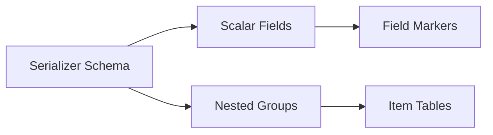
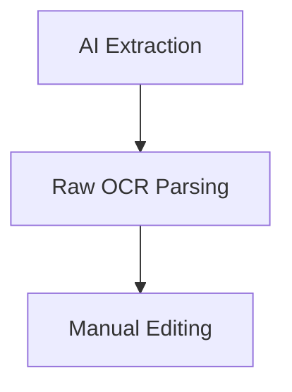

# Extraction Workbench

> **AI-Assisted Document Extraction & Form Population for Django Applications**

The Extraction Workbench is a schema-driven document scanning and data extraction tool that combines **OCR**, **LLM-powered structured extraction**, and a **visual review interface** to transform unstructured documents into structured JSON.

An Angular parent application launches the workbench in a popup window, passes a target Django serializer, and receives the extracted data back through `window.postMessage()` after user review and correction.


---

## Features

- ✅ Schema-driven extraction from any registered DRF serializer
- ✅ Browser-based OCR using Tesseract.js
- ✅ PDF support through PDF.js
- ✅ LLM-powered field mapping via Ollama
- ✅ Visual drag-and-drop correction workflow
- ✅ Support for nested and repeatable serializer structures
- ✅ No document-specific coding required
- ✅ Parent application integration using `postMessage`
- ✅ Fully functional even when OCR or AI extraction partially fails

---

## Architecture Overview





---

# Repository Structure

```text
Backend
├── ai_query/
│   ├── views.py
│   │   └── ExtractionWorkbenchAPIView
│   ├── utils.py
│   │   └── extraction_workflow()
│   └── urls.py
│
├── misc/
│   └── views.py
│       └── GetModelStructureAPIView
│
Frontend
└── ai_query/templates/
    └── extraction-workbench.html
```

---

# Technology Stack

| Layer | Technology |
|---------|-----------|
| Backend | Django |
| API | Django REST Framework |
| OCR | Tesseract.js |
| PDF Rendering | PDF.js |
| AI Extraction | Ollama |
| Frontend | Vanilla JavaScript |
| Communication | window.postMessage |

---

# Request Lifecycle

## 1. Launch

The parent application opens:

```javascript
window.open(
    "/extraction-workbench/?serializer=MaterialRequestSerializer&form_type=material-request"
);
```

### Query Parameters

| Parameter | Description |
|------------|------------|
| serializer | Target DRF serializer |
| form_type | Identifier for postMessage communication |
| form_url | Allowed target origin for postMessage |

---

## 2. Schema Generation

During page load, the backend introspects the specified serializer and generates a JSON schema representing all user-editable fields.

Example:

```json
{
  "vendor_name": {
    "type": "CharField",
    "required": true
  },
  "items": {
    "type": "NestedSerializer",
    "many": true,
    "nested": {
      "material": {
        "type": "CharField"
      },
      "quantity": {
        "type": "IntegerField"
      }
    }
  }
}
```

### Automatically Excluded Fields

```text
id
is_deleted
created_at
updated_at
created_by
updated_by
organization
```

Additional exclusions:

- SerializerMethodField
- FileField
- Circular self-referencing relationships

---

## 3. Document Upload

Supported formats:

- PNG
- JPG / JPEG
- PDF (first page)

### Processing Flow

#### Images

```text
FileReader
    ↓
HTML Image
    ↓
Workbench Canvas
```

#### PDFs

```text
PDF.js
    ↓
First Page Render
    ↓
Canvas Bitmap
```

The resulting bitmap becomes the single source of truth for:

- OCR
- Marker placement
- Visual editing
- Bounding box extraction

---

## 4. OCR Pipeline

OCR runs entirely within the browser using Tesseract.js.

```javascript
const result = await Tesseract.recognize(image, "eng");
```

Output example:

```json
{
  "text": "Invoice Number: INV-1001",
  "lines": [
    {
      "text": "Invoice Number: INV-1001",
      "bbox": {
        "x0": 100,
        "y0": 50,
        "x1": 300,
        "y1": 80
      }
    }
  ]
}
```

No OCR processing occurs on the server.

---

## 5. AI Extraction Pipeline

The client generates a strict extraction prompt using:

- OCR full text
- Serializer schema
- Nested field definitions

The request is sent to:

```http
POST /extraction-workbench/
```

Payload:

```json
{
  "query": "<generated extraction prompt>"
}
```

### Backend Flow



Expected AI output:

```json
{
  "document_no": "DOC-1001",
  "vendor_name": "ABC Suppliers",
  "items": [
    {
      "item_name": "Steel Rod",
      "quantity": 100
    }
  ]
}
```

---

# Frontend Data Model

The UI is entirely generated from the serializer schema.

## Schema Mapping



---

## Scalar Fields

Examples:

```json
{
  "invoice_no": "INV001",
  "vendor_name": "ABC Ltd"
}
```

Displayed as:

- Editable field list
- Draggable markers on canvas

---

## Nested Groups

Examples:

```json
{
  "items": [
    {
      "material": "Steel Rod",
      "quantity": "100"
    }
  ]
}
```

Displayed as:

- Editable tables
- Add / Remove row controls
- Individual marker locations

---

# Marker System

All fields and items use a shared marker model:

```javascript
{
  id,
  label,
  value,
  x,
  y,
  w,
  h,
  color
}
```

### Coordinate Strategy

Markers store coordinates as normalised values:

```text
0.0 → 1.0
```

Benefits:

- Zoom independent
- Resolution independent
- Window resize safe
- PDF scale safe

---

# Automatic Bounding Box Discovery

After AI extraction, values are matched back against OCR lines.

Example:

```text
OCR Line:
Invoice Number: INV-1001
```

AI returns:

```text
INV-1001
```

The workbench:

1. Searches OCR output
2. Locates matching text
3. Retrieves OCR bounding box
4. Places marker automatically

When no match is found, fallback marker positions are created.

---

# Manual Review & Correction

The user can refine extracted data before submission.

## Available Actions

### Move Markers

Drag marker body.

### Resize Markers

Use resize handles.

### Edit Values

Modify values in:

- Fields panel
- Items panel

### Extract From Boxes

Re-runs OCR on the currently selected marker region.

```text
Crop Document
      ↓
Run OCR
      ↓
Update Value
```

### Re-run OCR

Re-processes the entire document.

### Re-run AI Extraction

Uses existing OCR output but requests a fresh AI extraction.

### Reset Marks

Restores the most recently successful extraction result.

---

# Submit Process

When the user clicks **Submit**, the workbench generates:

```json
{
  "document_no": "DOC-1001",
  "vendor_name": "ABC Suppliers",
  "items": [
    {
      "item_name": "Steel Rod",
      "quantity": 100
    }
  ]
}
```

and sends it back to the opener window:

```javascript
window.opener.postMessage(
    {
        type: form_type,
        data: payload
    },
    form_url
);
```

The Angular application listens for the specified message type and populates the target form.

---

# API Reference

## GET `/extraction-workbench/`

Renders the extraction workbench.

### Parameters

| Name | Description |
|--------|-----------|
| serializer | Serializer class name |
| form_type | Message event identifier |
| form_url | Allowed target origin |

---

## POST `/extraction-workbench/`

Executes AI extraction.

### Request

```json
{
  "query": "<prompt>"
}
```

### Response

```json
{
  "message": {
    "content": "{...json...}"
  }
}
```

---

# Data Contracts

| Contract | Producer | Consumer |
|-----------|-----------|-----------|
| Serializer Schema | GetModelStructureAPIView | Workbench UI |
| OCR Text & Bounding Boxes | Tesseract.js | Prompt Builder & Marker Placement |
| Extraction JSON | Ollama | Workbench UI |
| postMessage Payload | Workbench | Parent Application |

---

# Design Principles

## Schema-Driven

The workbench is entirely driven by serializer metadata and contains no document-specific logic.

---

## Browser-Based OCR

OCR and PDF rendering happen entirely in the client browser.

Benefits:

- Lower infrastructure cost
- Reduced latency
- Better scalability

---

## Human-in-the-Loop

AI output is never considered final.

Users can:

- Review
- Edit
- Reposition
- Re-extract
- Validate

before submission.

---

## Progressive Degradation

The system always provides a usable path forward.



### Level 1

AI + OCR extraction

### Level 2

Label-value OCR parsing

Example:

```text
Vendor: ABC Ltd
```

becomes:

```json
{
  "vendor": "ABC Ltd"
}
```

### Level 3

Fully manual editing

Users are never blocked by OCR or AI failures.

---

# Known Considerations

## Ollama Invocation Pattern

Current implementation:

```python
def extraction_workflow(messages):
    ai_model = get_ai_model()
    result = ai_model.invoke({"messages": messages})
    return result["messages"][-1].content
```

appears to follow a LangGraph-style response pattern while invoking a plain `ChatOllama` model.

This should be validated against the installed LangChain/Ollama version to ensure the request and response formats remain compatible.

---

# Future Enhancements

- Multi-page PDF extraction
- Confidence scoring
- Field-level validation
- Multi-language OCR support
- Extraction history
- Audit logging
- Document classification
- Side-by-side OCR vs AI comparison
- Template training library

---

# Summary

The Extraction Workbench provides a reusable, serializer-driven document extraction experience for Django applications. By combining browser-based OCR, LLM-powered data mapping, and a visual human-review workflow, it enables rapid conversion of unstructured documents into structured application data with minimal backend complexity and maximum flexibility.
