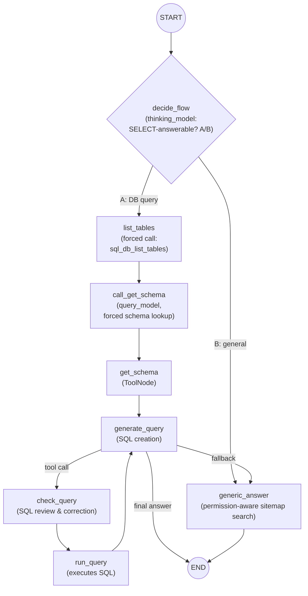

# AI Query Workflow

> A LangGraph-powered natural language query engine that intelligently routes user questions to either:
>
> - **Database-backed answers** via AI-generated, read-only SQL queries
> - **Application navigation and knowledge answers** via a permission-aware sitemap search

The workflow combines multiple LLMs, database metadata discovery, SQL self-validation, and user-permission-aware route recommendations to provide accurate and contextual responses.

---

# Overview

`query_workflow(question, logged_user_id)` enables users to ask natural language questions such as:

### Database Questions

> "Show the top 5 pending purchase orders"

> "Which projects were created this month?"

> "How many active employees are in the Kolkata office?"

The workflow automatically:

1. Detects that the question requires database access.
2. Discovers tables and schemas.
3. Generates a safe read-only SQL query.
4. Validates and corrects the SQL.
5. Executes the query.
6. Converts results into a human-readable answer.

### Application Navigation Questions

> "Where can I create a vendor?"

> "How do I manage user permissions?"

> "What page shows project progress?"

The workflow:

1. Searches a permission-aware sitemap.
2. Filters routes using the caller's actual permissions.
3. Returns the most relevant accessible page link.

---

# Architecture



---

# Inputs & Setup

| Item | Source | Purpose |
|--------|---------|----------|
| `question` | Caller | User's natural language query |
| `logged_user_id` | Caller | Used for permission filtering |
| `dialect` | `connection.vendor` | Provides SQL dialect context |
| `cursor` | `connection.cursor()` | Shared database cursor |
| `thinking_model` | `get_ai_model("thinking")` | Routing and answer generation |
| `query_model` | `get_ai_model("query")` | SQL generation and validation |

---

# Model Resolution

## `get_ai_model(tag)`

Selects the highest-priority `AIMaster` configuration whose tags match the requested tag and returns a configured `ChatOllama` client.

```python
thinking_model = get_ai_model("thinking")
query_model = get_ai_model("query")
```

### Benefits

- Separate reasoning and SQL models
- Independent tuning
- Easy model replacement
- Better cost optimisation

---

# Database Tools

All tools operate using the same database cursor.

## 1. List Tables Tool

### Tool

```python
sql_db_list_tables
```

### SQL

```sql
SHOW TABLES;
```

### Example Output

```text
users, employees, vendors, projects, purchase_orders
```

### Purpose

Provides table context before schema discovery.

---

## 2. Schema Discovery Tool

### Tool

```python
sql_db_schema
```

### SQL Executed

```sql
SHOW CREATE TABLE table_name;
```

and

```sql
SELECT * FROM table_name LIMIT 3;
```

### Returns

- Table structure
- Column definitions
- Constraints
- Sample rows

### Purpose

Helps the model understand relationships and available data.

---

## 3. Query Execution Tool

### Tool

```python
sql_db_query
```

### Example Query

```sql
SELECT *
FROM projects
LIMIT 5;
```

### Purpose

Executes model-generated SQL and returns results as text.

---

# LangGraph State

```python
class QueryState(MessagesState):
    next_flow: str
```

Extends LangGraph's `MessagesState` with a routing flag.

| Value | Meaning |
|---------|----------|
| `A` | Database query path |
| `B` | Generic answer path |

---

# Workflow Nodes

## 1. decide_flow

Uses `thinking_model` to determine whether the user's question can be answered using a read-only SQL query.

### Possible Responses

```text
A
```

or

```text
B
```

### Routing

| Result | Route |
|----------|--------|
| A | Database Query Flow |
| B | Generic Answer Flow |

---

## 2. list_tables

Automatically invokes:

```python
sql_db_list_tables
```

without requiring an LLM decision.

### Advantages

- Faster execution
- Reduced token usage
- More reliable schema selection

---

## 3. call_get_schema

Forces schema lookup using:

```python
tool_choice="any"
```

The model selects relevant tables and requests schema information.

---

## 4. get_schema

A `ToolNode` execution step that runs:

```python
sql_db_schema
```

and appends results to message history.

---

## 5. generate_query

Uses:

- Database dialect
- Table schemas
- Sample records

to generate read-only SQL.

### Rules

- SELECT only
- No DML statements
- No schema modifications
- Return ≤ 5 rows unless specified

### Example

```sql
SELECT
    po_number,
    vendor_name
FROM purchase_orders
WHERE status = 'Pending'
LIMIT 5;
```

---

## 6. check_query

Reviews generated SQL before execution.

### Checks Include

- `NOT IN` with NULL issues
- Incorrect join conditions
- Data type mismatches
- Quoting problems
- `UNION` vs `UNION ALL`
- BETWEEN boundary mistakes
- Aggregation errors

The model may rewrite and re-emit the query.

---

## 7. run_query

Executes the validated SQL.

### Example Output

```text
PO-101   ABC Metals
PO-102   XYZ Pvt Ltd
PO-103   Steel Industries
```

Results are appended to graph memory.

---

## 8. generate_query Loop

```text
generate_query
        ↓
check_query
        ↓
run_query
        ↓
generate_query
```

Allows the model to:

- Review actual results
- Refine queries
- Issue follow-up queries
- Produce a better final answer

---

## 9. generic_answer

Used when:

- The request is not database-related
- Navigation help is needed
- SQL generation fails

Uses:

```python
_relevant_sitemap_routes()
```

to retrieve accessible routes and answer the question.

---

# Permission-Aware Sitemap Search

## `_relevant_sitemap_routes()`

Ensures the model only sees routes the requesting user can access.

### Permission Sources

- `UserWisePermissions`
- `UserWiseSubModulePermissions`
- `UserWiseSettingPermissions`

### Supported Rights

```text
view
add
edit
```

---

## Route Ranking Algorithm

### Keyword Processing

The user's query is:

1. Tokenised
2. Stop words removed
3. Converted into keywords

### Route Scoring

| Match Type | Weight |
|------------|--------|
| Keyword Match | ×3 |
| Name Match | ×1 |
| Description Match | ×1 |
| Path Match | ×1 |

---

## Returned Route Format

```python
f"{FE_BASE}{path}"
```

### Example

```text
Vendor Master

https://app.company.com/vendor/create
```

Only if permitted for the current user.

---

# End-to-End Flow

```text
User Question
       │
       ▼
   decide_flow
       │
 ┌─────┴─────┐
 │           │
 ▼           ▼
DB Flow   Generic Flow
 │           │
 ▼           ▼
SQL Agent Sitemap Search
 │           │
 ▼           ▼
Answer     Answer
```

---

# Security Considerations

## Current Guardrails

Prompt instructions explicitly prohibit:

```sql
INSERT
UPDATE
DELETE
DROP
ALTER
TRUNCATE
```

and other non-read-only operations.

---

## Important Limitation

`sql_db_query` executes whatever SQL is passed to it.

Therefore, protection currently relies on:

- Prompt enforcement
- Tool routing
- Query validation logic
- Model compliance

### Recommended Improvements

- Read-only database credentials
- SQL parser validation
- Query allow-listing
- Statement classification
- DB-level permission controls

---

# Design Highlights

## Two-Model Separation

| Responsibility | Model |
|--------------|--------|
| Flow routing | Thinking Model |
| Final answers | Thinking Model |
| Schema discovery | Query Model |
| Query generation | Query Model |
| Query validation | Query Model |

### Benefits

- Better specialization
- Easier upgrades
- Lower operating costs
- Improved accuracy

---

## Forced Tool Invocation

Critical steps use:

```python
tool_choice="any"
```

Examples:

- List tables
- Schema loading
- Query validation

This ensures required tools cannot be skipped.

---

## Self-Correcting SQL Agent

```text
Generate Query
      ↓
Validate Query
      ↓
Execute Query
      ↓
Review Results
      ↓
Generate Better Query
```

Produces significantly higher-quality answers than single-pass SQL generation.

---

## Permission-Safe Navigation

The sitemap search layer guarantees:

✅ Only authorised routes are visible to the model

✅ No permission leakage

✅ No fabricated page links

✅ User-specific navigation assistance

---

# Invocation

The graph is compiled fresh for each request:

```python
agent = builder.compile()
```

Execution begins with:

```python
agent.invoke(
    {
        "messages": [
            {
                "role": "user",
                "content": question
            }
        ]
    }
)
```

The final response returned is:

```python
result["messages"][-1].content
```

---

# Cleanup

Database resources are always released regardless of outcome.

```python
finally:
    cursor.close()
```

This guarantees:

- Cursor cleanup
- Resource release
- Safe exception handling

---

# Summary

`query_workflow` is a lightweight LangGraph-based AI agent that combines:

- ✅ Natural Language Understanding
- ✅ Dynamic Schema Discovery
- ✅ AI-Powered SQL Generation
- ✅ SQL Validation & Correction
- ✅ Multi-Step Query Reasoning
- ✅ Permission-Aware Route Discovery
- ✅ Configurable Multi-Model Architecture
- ✅ Self-Healing Query Loops

to answer both **data-driven questions** and **application navigation requests** while respecting user permissions and maintaining a clear separation of concerns between reasoning and database interaction.
